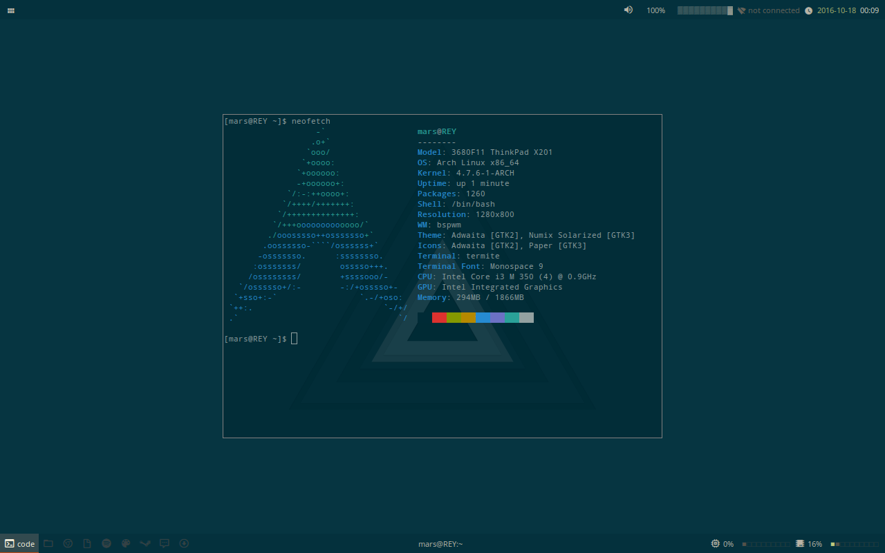
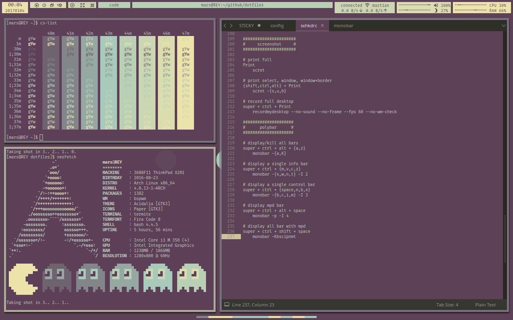

# Archlinux configuration files

## Solarized

* More screenshots from [imgur](http://imgur.com/a/A0xGd)
* [Details at /r/unixporn thread](https://www.reddit.com/r/unixporn/comments/57zffb/bspwm_my_current_fullsolarized_setup/d8w6w2h/)

## Acidalia

* Workflow on [teknik](https://u.teknik.io/wRWp8.webm)
* [Details at /r/unixporn thread](https://www.reddit.com/r/unixporn/comments/5lt9l8/bspwm_trying_something_different_with_polybar/dby9u53/)
